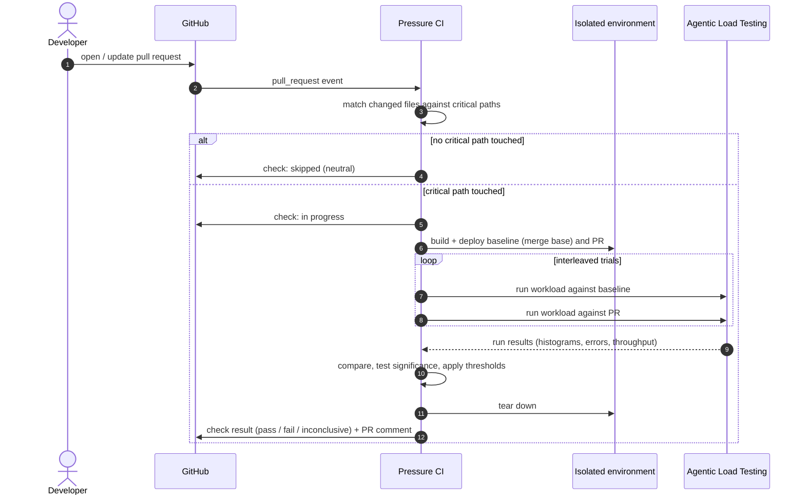

# Pressure CI

**Make sure your changes don't break it again.**

GitHub-native performance regression checks. When a pull request touches a critical production path, Pressure CI builds it, runs a representative workload against it and against `main`, compares the two, and reports the difference on the PR. Think Dependabot or CodeQL, but for performance.


<!-- Add CI / license badges once the workflows and LICENSE file exist. -->

> [!IMPORTANT]
> **Current state:** design stage. Nothing is installable yet. The first milestone is a **GitHub Action**
> that runs on your own runner against a Docker Compose environment (see [MVP](#roadmap)). The GitHub App,
> managed ephemeral environments and bottleneck hints are planned, not built.

Part of [Rhino](https://github.com/rhino-systems): [Behavioral Intelligence](https://github.com/rhino-systems/behavioral-intelligence) → [Agentic Load Testing](https://github.com/rhino-systems/agentic-load-testing) → Pressure CI.

---

## Contents

- [Why](#why)
- [How it works](#how-it-works)
- [Configuration](#configuration)
- [Example report](#example-report)
- [Measuring performance honestly](#measuring-performance-honestly)
- [Workload tiers](#workload-tiers)
- [Environments](#environments)
- [Security model](#security-model)
- [Integration modes](#integration-modes)
- [Roadmap](#roadmap)

---

## Why

Functional regressions get caught by tests on every PR. Performance regressions usually get caught by users, or by a load test someone runs before a big launch, weeks after the change that caused them was merged.

Running a full load test on every PR is too slow and too expensive. Running none means regressions slip through. Pressure CI sits in between:

- **Selective:** only PRs that touch paths you mark as critical trigger a run.
- **Comparative:** every result is PR vs baseline on the same infrastructure, never PR vs a stale number in a spreadsheet.
- **Statistical:** it reports a regression only when the difference is larger than the measured noise, and says "inconclusive" when it can't tell.
- **Realistic:** workloads come from [Agentic Load Testing](https://github.com/rhino-systems/agentic-load-testing) scenarios, and eventually from behavior learned by [Behavioral Intelligence](https://github.com/rhino-systems/behavioral-intelligence).

## How it works



1. **Detect:** match the PR's changed files against critical-path globs.
2. **Build** the PR head and the baseline (the merge base with `main`, so unrelated `main` changes don't pollute the comparison).
3. **Deploy** both to an isolated environment.
4. **Run** the configured workload against each, in interleaved trials.
5. **Collect** latency histograms, error rates, throughput, and optionally target-side metrics.
6. **Compare** using statistics, not single numbers.
7. **Report** in a GitHub check run and a PR comment.
8. **Gate:** optionally fail the check so branch protection can block the merge.

## Configuration

> [!CAUTION]
> **Conceptual example.** The configuration format doesn't exist yet and will change.

```yaml
# .github/pressure.yml (conceptual)
version: 0

critical_paths:
  - "src/api/**"
  - "src/database/**"
  - "src/auth/**"
  - "src/webrtc/**"
  - "infrastructure/**"
ignore_paths:
  - "**/*.md"
  - "**/*_test.go"

environment:
  kind: docker-compose            # later: deploy-hook, kubernetes
  file: deploy/perf/docker-compose.yml
  service_url: http://localhost:8080
  ready_check: { path: /healthz, timeout: 120s }

workload:
  scenario: perf/scenarios/session-join.toml   # an agentic-load-testing scenario
  tier: pr                                     # pr | nightly | release (see Workload tiers)
  warmup: 2m
  duration: 10m
  trials: 3                                    # per side, interleaved

thresholds:
  # A metric fails only if the change is significant AND exceeds both limits.
  p95_latency: { max_increase: 10%, min_absolute: 15ms }
  p99_latency: { max_increase: 20%, min_absolute: 50ms }
  error_rate:  { max_increase: 0.25pp }
  throughput:  { max_decrease: 5% }

per_operation:
  "POST /api/session/join":
    p95_latency: { max_increase: 5%, min_absolute: 10ms }

on_regression: fail      # fail | warn
```

## Example report

> [!NOTE]
> **Illustrative mock-up** of the planned PR comment. The numbers are made up. The "likely bottleneck"
> line is a planned heuristic feature, and will always be presented as a hint, never a diagnosis.

```text
⚠️ PERFORMANCE REGRESSION DETECTED

Population: 250,000 virtual users (nightly tier)   Duration: 20 min   Trials: 3 per side
Baseline: main @ 4f2c1e9 (merge base)              PR: #482 @ a91d03b

                  main        PR         change     95% CI           verdict
p95 latency       184 ms      247 ms     +34%       [+29%, +40%]     ❌ regression
p99 latency       492 ms      1.41 s     +187%      [+160%, +215%]   ❌ regression
error rate        0.12%       0.91%      +0.79 pp   [+0.70, +0.88]   ❌ regression
throughput        18.4 k/s    16.7 k/s   -9.2%      [-10.1%, -8.3%]  ❌ regression

Most affected operation:
  POST /api/session/join     p95 +61%, error rate +1.9 pp

Likely bottleneck (hint, from target-side metrics):
  database connection pool wait time rose from 3 ms to 140 ms (p95)

Changed critical paths: src/database/pool.rs, src/api/session.rs
Full report · Run artifacts · Re-run
```

When the difference is within noise, the report says so:

```text
✅ No significant performance change   (p95 -1.2%, 95% CI [-4.0%, +1.7%])
```

and when the measurement itself is too noisy to judge:

```text
❔ Inconclusive: baseline trials varied by 18% (p95). Consider more trials or a dedicated runner.
```

## Measuring performance honestly

Performance CI is mostly a fight against noise. The design choices that follow from that:

- **Same hardware, interleaved runs.** Baseline and PR run on the same machine, alternating (A B A B …), so drift in the host affects both sides equally.
- **Merge base as baseline.** Compare against the commit the PR branched from, not the current tip of `main`.
- **Warm-up excluded.** JIT, caches and connection pools are warmed before measuring.
- **Repeated trials and confidence intervals.** Percentile differences are reported with bootstrap confidence intervals; significance is tested across trials, not within a single run.
- **Relative *and* absolute thresholds.** +40% on a 2 ms endpoint is often irrelevant; both limits must be exceeded to fail.
- **Three verdicts, not two:** regression, no significant change, **inconclusive**. A tool that cries wolf gets turned off.
- **Noise tracking.** The run records baseline-vs-baseline variance, so you can see how sensitive your setup actually is.
- **Recommended: dedicated runners.** Shared CI runners are noisy. Pressure CI works on them, but will tell you when noise prevents a verdict.

## Workload tiers

Running 250,000 virtual users for 20 minutes on every PR is rarely sensible. Workloads are tiered:

| Tier | Trigger | Typical size | Goal |
|---|---|---|---|
| `pr` | PR touches a critical path | Small: fits a single runner, minutes | Catch clear regressions fast |
| `nightly` | Schedule on `main`, or a PR label like `pressure:full` | Larger, longer | Catch smaller regressions, trend tracking |
| `release` | Release branch / tag | Largest supported | Pre-release confidence |

The scale of each tier is limited by what [Agentic Load Testing](https://github.com/rhino-systems/agentic-load-testing#scaling-plan) can actually generate, which starts small.

## Environments

Pressure CI does not try to be a deployment platform. It supports a small number of ways to get an isolated build running:

| Kind | Status | Description |
|---|---|---|
| `docker-compose` | ⚪ Planned (MVP) | Builds and starts your Compose stack on the runner, once per side. |
| `deploy-hook` | ⚪ Planned | You provide `deploy` / `teardown` commands (Terraform, Helm, preview-environment scripts); Pressure CI gives them the commit and reads back a URL. |
| `kubernetes` | ⚪ Planned | Per-run namespaces, resource quotas, automatic teardown. |

Environments are always torn down after a run, including on failure or timeout.

## Security model

Running pull-request code with access to infrastructure is a real risk. Defaults:

- **Fork PRs never run automatically.** A maintainer must approve them, e.g. with a label, and they never receive deployment secrets.
- **Least-privilege GitHub permissions** for the planned App: `checks: write`, `pull_requests: write`, `contents: read`, `metadata: read`.
- **Isolated, ephemeral environments.** No shared state between runs, no production credentials.
- **Load only goes to the environment Pressure CI deployed.** The scenario target is overridden to the ephemeral environment's URL.
- **Secrets stay in your CI.** Self-hosted by default; Pressure CI doesn't need to see your secrets beyond what your own runner provides.

## Integration modes

| Mode | Status | Use when |
|---|---|---|
| **GitHub Action** | ⚪ Planned (MVP) | Fastest start: add a workflow, runs on your runners. |
| **CLI** (`pressure`) | ⚪ Planned (MVP) | Run the same comparison locally or in any CI system. |
| **GitHub App** (self-hosted) | ⚪ Planned | Org-wide policies, a queue of runs, status across repos, no per-repo workflow setup. |

Conceptual usage:

```yaml
# .github/workflows/pressure.yml (conceptual)
on: pull_request
jobs:
  pressure:
    runs-on: [self-hosted, perf]
    steps:
      - uses: actions/checkout@v4
        with: { fetch-depth: 0 }
      - uses: rhino-systems/pressure-ci@v0   # does not exist yet
        with:
          config: .github/pressure.yml
```

```bash
# Conceptual CLI
pressure detect  --base origin/main --head HEAD
pressure run     --config .github/pressure.yml --base origin/main --head HEAD --out results/
pressure report  results/ --format markdown
```

## Roadmap

### MVP: GitHub Action + CLI
- [ ] Critical-path detection from `.github/pressure.yml`
- [ ] Docker Compose environment for baseline and PR, sequential on one runner
- [ ] Run an Agentic Load Testing scenario against each side
- [ ] Compare p50 / p95 / p99, error rate, throughput with relative + absolute thresholds
- [ ] Markdown PR comment and pass/fail exit code
- [ ] Demo service with a deliberately introduced regression, used as an end-to-end test

### Trustworthy statistics
- [ ] Interleaved trials, warm-up exclusion
- [ ] Bootstrap confidence intervals, significance across trials
- [ ] Inconclusive verdict and noise reporting
- [ ] Per-operation breakdowns

### GitHub-native experience
- [ ] Check runs with annotations (Checks API)
- [ ] Self-hosted GitHub App: webhooks, run queue, org-wide policies
- [ ] Label-triggered full runs and fork-PR approval flow
- [ ] Historical trends on `main`

### Environments
- [ ] Deploy-hook environments
- [ ] Kubernetes namespaces with quotas and guaranteed teardown

### Insight
- [ ] Ingest target-side metrics (Prometheus / OpenTelemetry)
- [ ] Bottleneck hints from metric and trace diffs (connection pools, CPU, GC, lock wait), clearly labeled as heuristics
- [ ] Map regressions to changed files and operations

### Behavioral workloads
- [ ] Use behavior packs from Behavioral Intelligence as the default workload
- [ ] Workload coverage report: which user behaviors the PR was tested against

## Contributing

Feedback on the configuration format, the statistics, and the security model is especially welcome. Please open an issue before large changes.

## License

To be added. Apache-2.0 is the current plan.
